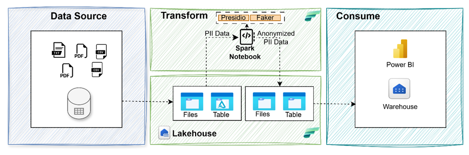

# 🔐 PII SparkShield

A PySpark-based framework for detecting and anonymizing Personally Identifiable Information (PII) using Microsoft Presidio, Faker, and Microsoft Fabric.



## 🚀 Features

- 🔍 PII Detection & redaction with Microsoft Presidio
- 🛡️ Anonymization via Masking, Hashing, and Encryption
- 🧪 Synthetic Data Generation using Faker
- ⚙️ Scalable on Microsoft Fabric (Lakehouse + Data Factory)

## 📁 Project Structure

- `notebooks/`: Jupyter notebooks with step-by-step examples
- `src/`: Core PySpark pipeline and utility functions
- `data/`: Sample input data
- `requirements.txt`: Python dependencies

---

## Redact PII Data for a Column in DataFrames
This method is designed to process DataFrames containing columns with potentially sensitive personally identifiable information (PII). It identifies and redacts PII by replacing detected entities with a placeholder text.

## Typical Use Cases

### Unstructured Data
Useful for processing columns extracted from unstructured sources such as `.txt` or `.pdf` files, where free-form text may contain PII.

### Structured Data
Can be applied to columns like comments, feedback, or notes in structured tables, where text fields may also include PII.

## 📓 Notebooks
01_pii_detection_presidio.ipynb: Detect, Redact PII using Presidio

---
## Method
def identify_and_redact_pii_column(df, column_name, replacement_txt, output_column_name)

## Args

- `df` – Spark DataFrame consisting of the dataset  
- `column_name` – Column name for which PII data needs to be redacted  
- `replacement_txt` *(Optional)* – Replacement text. Default: `{Entity type}`  
- `output_column_name` *(Optional)* – Output column name. Default: `{column_name}_redacted`

---

## Returns

- `anonymizedDataframe` – DataFrame with a new redacted column

## Usage
```
df = identify_and_redact_pii_column(df, "EmailAddress", replacement_txt="MASKED")
```
Since the replacement_text is passed as "MASKED" all identified PII entities will be replaced with "MASKED". 
A Dataframe will be returned with redacted column with column name {EmailAddress__redacted} is returned.

```
df = identify_and_redact_pii_column(df, "EmailAddress")

```
Since the replacement_text is not passed all identified PII entities will be replaced with "{EMAIL_ADDRESS}.e.g.  
A Dataframe with redacted column with column name {EmailAddress__redacted} is returned.


---


---

## How It Works

### Detection
The method scans the specified column for PII entities using an NLP-based analyzer.

### Redaction
Detected PII is replaced with a placeholder (e.g., `"REDACTED"` or `"ANONYMIZED"`), ensuring sensitive information is not exposed.


## 🧰 Setup
1. Create a new Fabric lakehouse or use existing lakehouse within Fabric.
1. Create a folder sampledata in lakehouse. Download "" sample file from "" location.
1. Installing the large model from the lakehouse as it exceeds the size limit for custom libraries in the Fabric environment.
1. 


Limitations
Currently only support english
