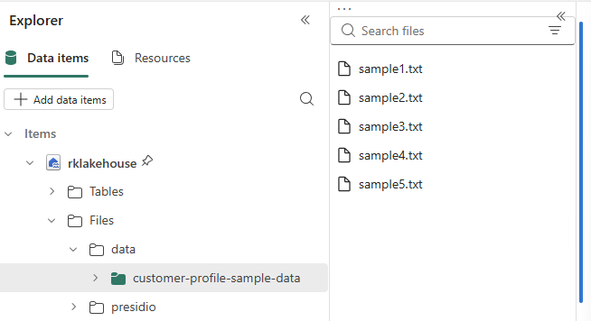
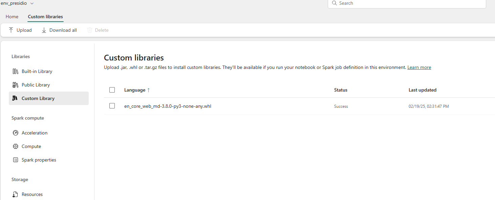

# 🔐 PII SparkShield

A PySpark-based framework for detecting and anonymizing Personally Identifiable Information (PII) using Microsoft Presidio, Faker, and Microsoft Fabric.

# 🚀 Features

- 🔍 PII Detection & redaction with Microsoft Presidio
- 🛡️ Anonymization via Masking, Hashing, and Encryption
- 🧪 Synthetic Data Generation using Faker
- ⚙️ Scalable on Microsoft Fabric (Lakehouse + Data Factory)

# 📁 Project Structure

- `notebooks/`: Jupyter notebooks with step-by-step examples
- `src/`: Core PySpark pipeline and utility functions
- `data/`: Sample input data
- `requirements.txt`: Python dependencies

---
There are multiple approaches to implementing data privacy at scale using  PySpark. This repository focuses specifically on the following three approaches using PySpark as processing engine.
1. Identify and anonymizing PII in Structured and Unstructured Data Using Presidio
2. Generate Synthetic Data Using Faker for Anonymization
3. Use Built-in PySpark Functions for Hashing and Masking

Each of these approaches are covered in detail in seperate folder

## Identify and anonymizing PII in Structured and Unstructured Data Using Presidio

### 📓 Notebooks
01_pii_detection_redaction_presidio.ipynb: Identify, Redact PII using Presidio

This notebook contains function designed to process DataFrames containing columns with potentially sensitive personally identifiable information (PII). It identifies and redacts PII by replacing detected entities with a placeholder text.

### Typical Use Cases
- **Unstructured Data** - Useful for processing columns extracted from unstructured sources such as `.txt` or `.pdf` files, where free-form text may contain PII.
- **Structured Data** - Can be applied to columns like comments, feedback, or notes in structured tables, where text fields may also include PII.

### How It Works?
- **Detection** - The method scans the specified column for PII entities using an NLP-based analyzer.
- **Redaction** - Detected PII is replaced with a placeholder (e.g., `"REDACTED"` or `"ANONYMIZED"`), ensuring sensitive information is not exposed.

## 🧰 Environment Setup
1. **Fabric workspace** with sufficient permissions to create and manage custom environments.
    1. Create a new Fabric lakehouse or use existing lakehouse within Fabric. Refer [this](https://learn.microsoft.com/en-us/fabric/data-engineering/tutorial-build-lakehouse#create-a-lakehouse) for more details.
    1. Create a folder sampledata in lakehouse. Download "" sample file from "" location.
1. **Configure Spark Pool** Make sure to create (or select) a valid Spark pool that you can attach to your Fabric environment.
1. **Create a New Environment**
    1. In your Fabric workspace, go to Settings and select New Environment.
    1. Provide a name (e.g., presidio-env) and choose the appropriate Python version.
    1. Configure any required settings (e.g., pinned versions, advanced options).
1. **Add Dependencies**
    1. Under Public Library, add the essential libraries:
    1. presidio-analyzer
    1. presidio-anonymizer
    1. spacy
    
    When using Microsoft Presidio with spaCy, you can choose between different spaCy model sizes such as en_core_web_md (medium, typically under 300MB) and en_core_web_lg (large, usually over 800MB).
    **Medium (en_core_web_md)**: Contains word vectors, but these are smaller and less comprehensive than those in the large model. This model is designed to balance accuracy and resource usage.
    **Large (en_core_web_lg)**: Includes much larger word vectors, which are used as features during prediction. This generally results in slightly better performance, especially for tasks that benefit from richer semantic information, but at the cost of increased memory and disk usage
    1. For smaller/medium SpaCy models (like en_core_web_md < 300MB), you can include them directly in this environment.
    
    1. Upload a Large SpaCy Model
    If you want to use en_core_web_lg (which typically exceeds 300MB): 
        1. Create a folder "presidio" and within that, create a folder "models". Installing the large model from the lakehouse as it exceeds the size limit for custom libraries in the Fabric environment. Upload the .whl file to your Lakehouse (or any location accessible by Spark). The spaCy model can be downloaded from [here](https://spacy.io/models/en#en_core_web_lg).
        2. You will install it within the notebook rather than from this environment.
    
    1. Compute
    Configure your compute, make sure to use the pool configured before
    
    1. Review & Save
    Confirm your chosen libraries appear under the Custom Library or Public Library tabs.
    Click Save to finalize your environment setup.

### Run the Sample Notebook
1. Open the presidio_and_spark.ipynb notebook
1. When opening your notebook, ensure you pick the custom environment you created.
1. Confirm you have selected the valid Spark pool you configured earlier.

### Performance Optimization Techniques used in notebooks
1. Pandas UDFs (also known as vectorized UDFs) process data in batches using Pandas Series, which significantly reduces serialization overhead and leverages vectorized operations, making them much faster than standard Python UDFs—especially for large datasets
2. Broadcasting tells Spark to serialize the object only once, send it to each worker node once, and reuse it for all tasks on that node.This is especially important for large, read-only objects like NLP models or engines.
If you reference a Python object (like analyzer,anonymizer) directly inside a UDF, Spark will serialize and send a separate copy of that object to every worker and every task.

For heavy objects (like NLP models, which can be hundreds of MB), this is inefficient and can lead to:
- High memory usage
- Increased network traffic
- Slow job startup

---
## Generate Synthetic Data Using Faker for Anonymization

---

Limitations
Currently only support english
